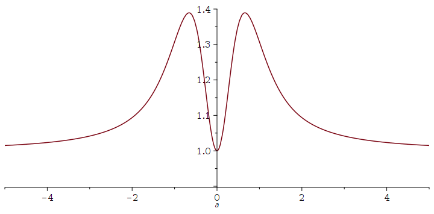

# Fused Snake activation

Memory- and compute-efficient fused PyTorch implementation of the Snake activation function from [Neural Networks Fail to Learn Periodic Functions and How to Fix It (arXiv:2006.08195)](https://arxiv.org/abs/2006.08195) using [Triton](https://github.com/openai/triton) or TorchScript. Snake has been shown to model periodic data well, particularly when it comes to generalizing beyond regions of data seen during training. See also: [BigVGAN: A Universal Neural Vocoder with Large-Scale Training](https://arxiv.org/abs/2206.04658).

I have also implemented the Kaiming initializations and variance correction discussed in section 5 of the paper. Since the section was quite vague, I rederived it to be certain it is correct.

### Forward pass timings on V100:

Triton version:
```
In [1]: S = Snake(48).cuda()
   ...: x = torch.randn(50, 48, 10 * 16000, device='cuda')
   ...: s = S(x)

In [2]: torch.cuda.max_memory_allocated() / 1024 / 1024
Out[2]: 3173.82861328125

In [3]: %timeit S(x); torch.cuda.synchronize()
3.97 ms ± 8.59 µs per loop (mean ± std. dev. of 7 runs, 100 loops each)
```

TorchScript version:
```
In [1]: S = Snake(48).cuda()
   ...: x = torch.randn(50, 48, 10 * 16000, device='cuda')
   ...: s = S(x)

In [2]: torch.cuda.max_memory_allocated() / 1024 / 1024
Out[2]: 4394.5322265625

In [3]: %timeit S(x); torch.cuda.synchronize()
9.42 ms ± 4.11 µs per loop (mean ± std. dev. of 7 runs, 100 loops each)
```

Plain PyTorch version:
```
In [1]: x = torch.randn(50, 48, 10 * 16000, device='cuda')
   ...: alpha = torch.randn(48, 1, device='cuda')
   ...: s = x + torch.sin(alpha * x) ** 2 / alpha

In [2]: torch.cuda.max_memory_allocated() / 1024 / 1024
Out[2]: 4394.53173828125

In [3]: %timeit x + torch.sin(alpha * x) ** 2 / alpha; torch.cuda.synchronize()
20.3 ms ± 1.41 µs per loop (mean ± std. dev. of 7 runs, 10 loops each)
```

### Backward pass timings on V100:

Triton version:
```
In [1]: S = Snake(48).cuda()
   ...: x = torch.randn(50, 48, 10 * 16000, device='cuda', requires_grad=True)
   ...: y = S(x).sum()

In [2]: %timeit y.backward(retain_graph=True); torch.cuda.synchronize()
11.6 ms ± 3.37 µs per loop (mean ± std. dev. of 7 runs, 100 loops each)
```

TorchScript version:
```
In [1]: S = Snake(48).cuda()
   ...: x = torch.randn(50, 48, 10 * 16000, device='cuda', requires_grad=True)
   ...: y = S(x).sum()

In [2]: %timeit y.backward(retain_graph=True); torch.cuda.synchronize()
15.4 ms ± 2.84 µs per loop (mean ± std. dev. of 7 runs, 100 loops each)
```

Plain PyTorch version:
```
In [1]: x = torch.randn(50, 48, 10 * 16000, device='cuda', requires_grad=True)
   ...: alpha = torch.randn(48, 1, device='cuda', requires_grad=True)
   ...: y = (x + torch.sin(alpha * x) ** 2 / alpha).sum()

In [2]: %timeit y.backward(retain_graph=True); torch.cuda.synchronize()
61.8 ms ± 7.91 µs per loop (mean ± std. dev. of 7 runs, 10 loops each)
```

## Network initialization

I have implemented functions for initializing network parameters preceding Snake activations based on Kaiming initialization. They are unclear about this in the paper, but this comes with some caveats:
* The initialization motivations are weaker than for Kaiming initialization with ReLU because the second moment of the activations is not a linear function of the previous layer's variance - we have to assume a distribution on the previous layer's activation. The authors assume a standard Gaussian.
* The authors discuss initializing based on the approximation that the second moment of the Snake activation is 1 (given a standard Gaussian input). However this is not the case, see the second moment plotted below. We see that the approximation is pretty good for large |x| and close to x=0, but not particularly good otherwise. I have added the option to use the exact second moment in the initialization, and the option to account for variance correction in the initialization.
* In order to justify the initial assumption of the previous layer's variance being standard Gaussian, the authors suggest normalizing the activation output by its standard deviation. If your network is unstable, try using variance correction.



## Variance correction

Regarding the variance correction:

* I don't see the reason why they mention the maximum of the variance?
* Normalizing the post-activation value by the standard deviation makes sense as it makes the output of each activation more standard Gaussian-like in order to better fulfill the initial standard Gaussian assumption.
* Although normalizing by the standard deviation will make the output unit variance, we generally do not know what distribution it takes except that it is symmetric. This is probably still better than doing nothing in all cases, and as the authors show experimentally it does seem to help for very deep networks.
* Another option is to normalize each activation *by its initial value of alpha* as this would let the post-activation variance be 1 *at initialization* without introducing additional gradient calculations - I have not tested this approach.
